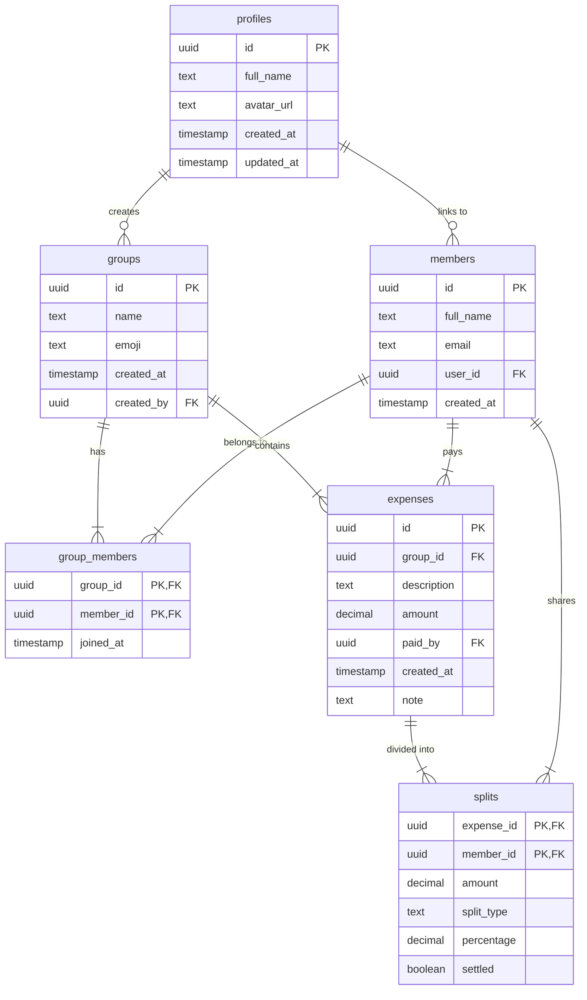

```mermaid
erDiagram
    profiles {
        uuid id PK
        text full_name
        text avatar_url
        timestamp created_at
        timestamp updated_at
    }
    
    members {
        uuid id PK
        text full_name
        text email
        uuid user_id FK
        timestamp created_at
    }
    
    groups {
        uuid id PK
        text name
        text emoji
        timestamp created_at
        uuid created_by FK
    }
    
    group_members {
        uuid group_id PK,FK
        uuid member_id PK,FK
        timestamp joined_at
    }
    
    expenses {
        uuid id PK
        uuid group_id FK
        text description
        decimal amount
        uuid paid_by FK
        timestamp created_at
        text note
    }
    
    splits {
        uuid expense_id PK,FK
        uuid member_id PK,FK
        decimal amount
        text split_type
        decimal percentage
        boolean settled
    }

    profiles ||--o{ groups : "creates"
    profiles ||--o{ members : "links to"
    groups ||--|{ group_members : "has"
    members ||--|{ group_members : "belongs to"
    groups ||--|{ expenses : "contains"
    members ||--|{ expenses : "pays"
    expenses ||--|{ splits : "divided into"
    members ||--|{ splits : "shares"
```
